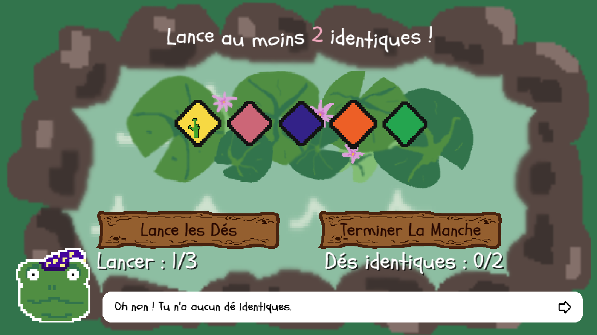
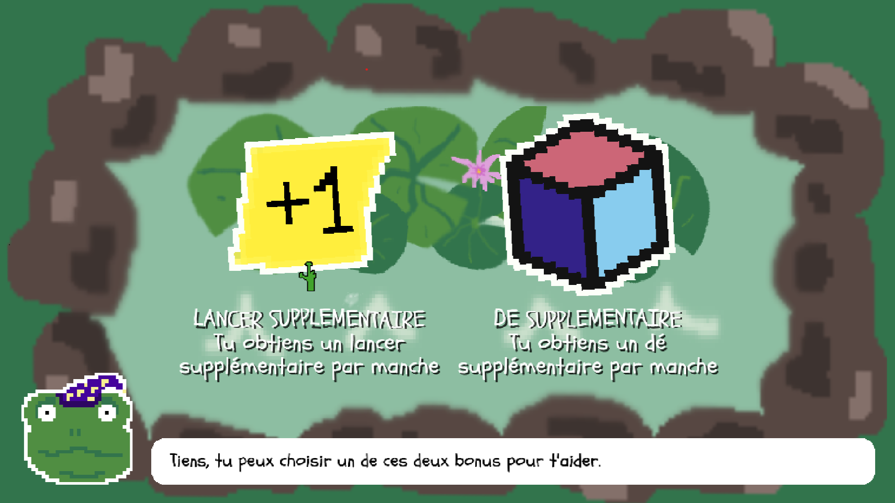

 
## Description
Todds est petit jeu de dés créé pour le cours  "*Développement de jeu vidéo 2D*" dispensé par Isaac Pante à l'Université de Lausanne. 
Le but du jeu est de tirer des paires, puis brelan, etc. de dés de la même couleur. Afin de réussir les joueur·euses peuvent choisir des bonus lorsqu'iels échouent un niveau.

Le jeu a été développé avec <a href="https://kaplayjs.com/" target="_blank">kaplay</a> et utilise le plugin <a href="https://github.com/loiccattani/kaplay-loquace" target="_blank">loquace</a> afin de gérer les interactions textuelles.

Le jeu se joue entièrement à la souris. Les joueur·euses peuvent sécletionner les dés en cliquant dessus, puis les relancer en appuyant sur le bouton **Lance les Dés**. La fin de la manche est toujours déterminé par les joueur·euses.

## Utilisation
Le jeu est directement jouable dans le navigateur, sur sa page <a href="https://squidez.itch.io/todds">itch.io</a> dédiée.  
Autrement il suffit d'exécuter localement le fichier ``index.html``. *Kaplay* est importé directement dans le script ``main.js`` et **loquace** depuis le fichier source du code situé dans ``src/kaplay-loquace.js``

**note:** Le jeu utilise encore la version *v3001* de *Kaplay*. La nouvelle version *v4000* a été publié pendant le développement du jeu. Malheureusement elle entre en conflit avec *loquace* en faisant apparaître les pop-up de texte sous le *layout* du jeu.

## Crédits

Sauf indication contraire, l'ensemble des assets graphiques, sonores et la musique ont été réalisé par mes soins. 
L'animation des dés est dérivée du pack <a target="_blank" href="https://dani-maccari.itch.io/cute-dice">Cute Dice</a> par Dani Maccari. 
La police d'écriture utilisée dans le jeu est <a href = "https://fonts.google.com/specimen/Schoolbell"> <i>Schoolbell</i></a> designée par *Font Diner*.

Aucun LLM et aucune IA générative n'ont été utilisé lors du développement.

